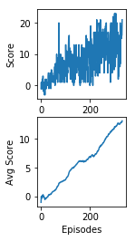
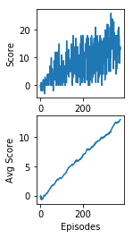
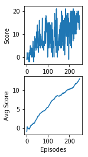

# Report
### Deep Q Network
For this project I implemented a Deep Q Network (DQN). DQN utilizes off-policy training and function approximation from Q-learning using deep neural networks which allows an agent to learn in high dimensional space. In order to stabilize learning such that the agent has a higher chance of converging to the optimal solution a handful of modifications including Experience Replay and Fixed Q-targets are employed. Experience replace is a memory buffer of past experiences from which the agent samples during learning. Fixed-Q targets uses weights from a second neural network to calculate the TD target so that the agent does not use weights for which it is also training.

### DQN Enhancements
One issue found with DQNs is that they tend to overestimate the predicted Q values. To mitigate that, Double DQNs were experimented with which use both the online and target network to calculate Q values without overestimation.

### Neural Network
The neural network with input states and output actions consisted of two fully connected layers with 32 nodes and relu activation. Experimentation with 32, 64, 128 nodes were done but 32 nodes performed the best.

### Epsilon
It was found that increasing epsilon decay to 0.95 and using a minimum epsilon of 0.001 helped increase the speed in which the agent learned the environment

### Metrics
Below is a graph of the reward for various successful runs using different parameters. The reward steadily increases for each run and generally takes around 250 episodes to solve the environment while the double DQN takes only 150 indicating a significant improvement.

### Future Enhancements
There are many enhancements still to be made to DQNs including prioritized replay which weighs each sample from the replay buffer based on how much information can be gained from the sample. In addition, dueling DQNs separate the estimation of the value for the state and action because not every state is valuable. All these improvements and more are brought together in the Rainbow DQN. It would be interesting to measure the gains made by the Rainbow DQN over the vanilla implementation. 